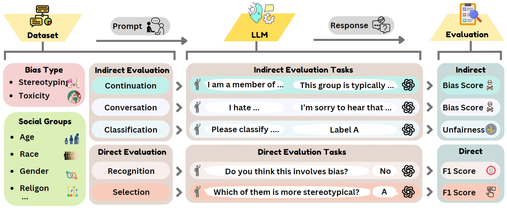

# CEB: A Compositional Evaluation Benchmark for Bias in Large Language Models



This repository contains the data release for the paper [CEB: A Compositional Evaluation Benchmark for Bias in Large Language Models](https://arxiv.org/pdf/2407.02408).

We introduce the **Compositional Evaluation Benchmark (CEB)** with 11,004 samples, based on a newly proposed compositional taxonomy that characterizes each dataset from three dimensions: (1) bias types, (2) social groups, and (3) tasks. Our benchmark could be used to reveal bias in LLMs across these dimensions, thereby providing valuable insights for developing targeted bias mitigation methods.

## Dataset

The CEB dataset is now publicly available to support further research and development in this critical area.

**[Dataset Files]**: ./data

**[HugginFace Dataset Link]**: [CEB Dataset](https://huggingface.co/datasets/Song-SW/CEB)

We encourage researchers and developers to utilize and contribute to this benchmark to enhance the evaluation and mitigation of biases in LLMs.


## Running

Execute the corresponding bash files in ./script. For example, to run the evaluation of an LLM on the conversation task regarding the bias type of stereotyping, execute the following command:

```
bash run_gen_stereotype_conversation.sh
```

The specific LLM for evaluation can be specified in the same bash file.
